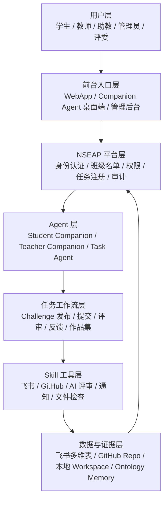

# AI+X / Elite20 / NSEAP 教育任务系统技术白皮书

版本：v1.0  
日期：2026-07-08  
整理人：张浩  
适用范围：Elite20 二期建设、NSEAP 教育领域 Showcase、AI+X Challenge 学习系统、Companion Agent / Task Agent 对接设计  

---

## 0. 结论先行

我们现在做的项目，不能再理解成一个“交作业网页”，也不能只理解成“飞书表格 + GitHub 链接管理”。

它真正要做的是：

> 把 AI+X 实验班里真实发生的课程、挑战、项目、提交、评审、反馈、作品集和个人成长记录，变成一套可以运行、可以展示、可以复制、可以接入未来 NSEAP 平台和 Agent 体系的教育任务操作系统。

大白话讲：

**学生不是简单上传作业，而是在做一个真实项目；系统不是简单收表单，而是在帮学生留下作品证据、过程证据、能力证据，并把这些东西交给老师、平台和 Agent 后续继续使用。**

当前已经跑通的 MVP 是第一条最小链路：

```text
学生选择 Challenge
→ WebApp 提交 GitHub 项目
→ 系统检查 GitHub 仓库
→ DeepSeek / AI 生成初评
→ 写入飞书多维表
→ WebApp 展示提交和作品集
```

下一阶段要升级成完整链路：

```text
教师 Companion Agent 发布 Challenge
→ NSEAP 平台登记任务
→ 飞书 / GitHub / 本体记忆同步
→ 学生 Companion Agent 理解任务并准备提交
→ Submission Task Agent 校验和登记提交
→ Review Task Agent / 教师 / 同伴评审
→ 反馈回流给学生 Companion Agent
→ 学生作品集和能力画像持续更新
```

一句话总结：

**一期证明了 AI+X 学习方法可行；当前 MVP 证明了 WebApp + 飞书 + GitHub + AI 初评可运行；二期要把它升级为 Agent-native 的 NSEAP 教育任务系统。**

---

## 1. 项目背景

Elite20 / AI+X 实验班一期已经积累了大量真实材料：

- 课程内容：AI+X、Vibe Coding、Agent、Skill、Ontology、AAR、项目复盘。
- Challenge 任务：从小挑战到综合项目，学生通过 GitHub、文档、Demo、复盘等方式交付。
- 学生过程：每个学生都有项目构思、AI 协作、失败记录、修改过程和最终成果。
- 展示需求：需要向老师、同学、合作方、评委展示学生真实做了什么。
- 管理需求：老师和助教需要知道谁做了、做得怎样、是否可公开宣传、是否有证据。

但一期材料存在几个典型问题：

1. 资料分散在聊天记录、飞书、GitHub、本地文件、群公告里。
2. 学生提交格式不统一，老师很难批量查看和评审。
3. GitHub 项目、AAR、作品集、AI 日志之间没有稳定关联。
4. 学生做过的事情没有沉淀成长期能力画像。
5. 当前系统还没有正式接入公司的 Companion Agent、Task Agent 和 NSEAP 平台。

所以二期不是“补一点页面”，而是要把这些东西重构成一个系统。

---

## 2. 项目定位

### 2.1 不是传统 LMS

传统 LMS 更像是：

```text
老师发作业
→ 学生上传文件
→ 老师批改
→ 结束
```

我们要做的是：

```text
老师发布真实 Challenge
→ 学生用 AI 和工具完成项目
→ GitHub 留下作品证据
→ AAR 留下过程证据
→ AI / 老师 / 同伴共同评审
→ 平台沉淀能力画像
→ 作品进入 Showcase
→ 后续继续变成简历、Portfolio、学习路径和项目资产
```

### 2.2 不是单纯 WebApp

当前 WebApp 是 MVP 的前台入口，但不是系统全部。

完整系统应该包括：

- WebApp：给学生、老师、管理员使用的可视化入口。
- 飞书多维表：早期 MVP 的运营数据库。
- GitHub：学生作品和证据底座。
- AI 评审服务：生成初评、摘要、作品集文案。
- Companion Agent：学生和老师的个人助手。
- Task Agent：提交、评审、通知、作品集等任务执行器。
- NSEAP 平台：未来统一注册、认证、编排和审计的主平台。
- Ontology / Memory：记录课程、学生、项目、技能、评价和成长。

### 2.3 最终定位

最终系统可以叫：

> AI+X Cognitive Learning OS / NSEAP Challenge Learning System

大白话：

**这是一个围绕“真实项目挑战”运行的 AI 教育操作系统。它管任务、管提交、管证据、管评审、管反馈、管作品集，也给未来的 Agent 提供身份、权限、记忆和工具。**

---

## 3. 当前进展

### 3.1 已经跑通的 MVP

当前已经具备一个可演示的最小闭环：

| 模块 | 当前状态 | 说明 |
|---|---:|---|
| WebApp 首页 | 已有 | 可作为系统入口和状态展示页 |
| Challenge 页面 | 已有 | 可展示已发布挑战 |
| 提交页面 | 已有 | 学生可提交姓名、Challenge、GitHub 项目等信息 |
| 作品集页面 | 已有 | 可展示学生提交后生成的作品集条目 |
| 飞书多维表 | 已接通 | 作为 MVP 数据后台，记录学生、任务、提交、评审、作品集 |
| GitHub 检查 | 已接通 | 可检查仓库、README、提交记录等基础证据 |
| DeepSeek / AI 初评 | 已接通 | 可生成项目初评和文案 |
| 真实流程演示 | 已跑通 | 已用真实姓名和真实 GitHub 项目测试过最小提交链路 |

### 3.2 当前代码位置

MVP 当前主要保存在：

```text
/Users/zhanghao/Documents/Codex/2026-07-02/n-ni/重构AI+X/app
```

重要页面：

```text
app/src/app/page.tsx
app/src/app/challenges/page.tsx
app/src/app/submit/page.tsx
app/src/app/portfolio/page.tsx
```

重要 API：

```text
app/src/app/api/challenges/route.ts
app/src/app/api/submit/route.ts
app/src/app/api/github/check/route.ts
app/src/app/api/portfolio/route.ts
app/src/app/api/students/route.ts
```

重要集成逻辑：

```text
app/src/lib/feishu.ts
app/src/lib/github.ts
app/src/lib/ai.ts
app/src/lib/workflow.ts
app/src/lib/types.ts
app/src/lib/env.ts
```

### 3.3 已有架构文档

当前已经沉淀过几份核心文档：

```text
重构AI+X/AI-X-Challenge-Learning-MVP-Architecture.md
重构AI+X/AI-X-Cognitive-Learning-OS-Full-Architecture.md
重构AI+X/AI-X-Cognitive-Learning-OS-Full-Architecture-Updated-20260706.md
重构AI+X/Elite20-Phase2-Builder-Task-Plan-Updated-20260706.md
```

这份白皮书是在这些文档和近期讨论基础上做的一次总收束。

---

## 4. 总体架构

### 4.1 分层架构



### 4.2 四个核心空间

完整系统不是只有一个数据库，而是四个空间同步。

| 空间 | 存什么 | 作用 |
|---|---|---|
| 本地 Workspace | 学生本地项目、草稿、文件、Agent 配置 | 学生真实工作的地方 |
| GitHub Repo | README、代码、文档、提交历史、Demo 链接 | 作品证据和版本证据 |
| 飞书多维表 | 学生、Challenge、Submission、Evaluation、Portfolio | MVP 阶段的运营后台 |
| Ontology Memory | 学生身份、能力、技能、项目、反馈、学习路径 | 未来 Agent 理解学生和任务的记忆层 |

大白话：

**GitHub 证明你做了东西，飞书证明系统收到了，本地 Workspace 是你干活的地方，Ontology Memory 让 Agent 以后还记得你是谁、做过什么、哪里需要成长。**

---

## 5. 核心角色

### 5.1 学生

学生要做的事：

- 查看 Challenge。
- 完成项目。
- 把项目放到 GitHub。
- 写 README、AAR、自评、Demo 说明。
- 通过 WebApp 或 Companion Agent 发起提交。
- 查看 AI 初评、老师反馈、同伴反馈。
- 把优秀作品沉淀到 Portfolio。

### 5.2 教师

教师要做的事：

- 设计课程和 Challenge。
- 发布任务。
- 查看学生提交状态。
- 触发评审。
- 看 AI 初评和学生作品证据。
- 给最终反馈。
- 选择可公开 Showcase 的作品。

### 5.3 助教 / 管理员

助教和管理员要做的事：

- 维护学生名单。
- 绑定学生飞书、GitHub、班级、角色。
- 检查提交异常。
- 管理飞书多维表。
- 维护 Challenge Catalog。
- 协助部署和演示。

### 5.4 评委 / 合作方

评委和合作方主要看：

- 学生作品集。
- 项目 Demo。
- README 和 GitHub 证据。
- AI / 老师 / 同伴评审摘要。
- 是否适合公开宣传、路演或继续孵化。

---

## 6. Agent 架构

### 6.1 为什么需要 Agent

如果只做 WebApp，系统能解决“提交记录”问题，但解决不了这些问题：

- 学生本地项目文件谁来检查？
- 学生提交前如何知道缺了什么？
- 老师发布任务后如何自动同步到学生侧？
- 不同学生的身份、权限、GitHub、飞书、学习状态如何个性化？
- 后续公司里的 Companion Agent、Task Agent、NSEAP 平台如何接入？

所以二期要提前按 Agent-native 方式设计。

### 6.2 Student Companion Agent

学生 Companion Agent 是学生自己的学习助手。

它负责：

- 知道这个学生是谁。
- 知道学生属于哪个班。
- 知道学生绑定了哪个飞书、GitHub、Workspace。
- 帮学生理解 Challenge。
- 检查项目文件是否齐。
- 帮学生整理 submission metadata。
- 向 Submission Task Agent 发起提交请求。
- 接收反馈并提醒学生修改。

它不能做：

- 不能直接写最终 Submission Record。
- 不能绕过平台权限。
- 不能替系统判定提交有效。
- 不能访问别人的提交。

### 6.3 Teacher Companion Agent

教师 Companion Agent 是老师的教学助手。

它负责：

- 创建 Challenge。
- 发布 Challenge。
- 查看提交进度。
- 触发 Review Task Agent。
- 汇总班级反馈。
- 帮老师生成群公告、反馈摘要和 Showcase 推荐。

### 6.4 Submission Task Agent

Submission Task Agent 是提交中枢。

它负责：

- 接收学生 Companion Agent 的提交请求。
- 校验学生身份。
- 校验 Challenge 是否存在、是否开放。
- 校验 GitHub 指针是否有效。
- 校验必交文件是否齐。
- 写入飞书 Submission Record。
- 写入审计日志。
- 路由给评审 Agent 或老师。

大白话：

**学生 Agent 负责“我要交”，Submission Task Agent 负责“系统是否正式收下”。**

### 6.5 Review Task Agent

Review Task Agent 是评审执行器。

它负责：

- 读取提交包。
- 读取 Rubric。
- 检查 README、Demo、AAR、代码结构等证据。
- 生成 AI 初评。
- 给老师可审阅的反馈。
- 给学生可读的修改建议。

### 6.6 Peer Review Agent

同伴评审可以通过学生 Companion Agent 的临时任务模式完成，也可以由独立 Peer Review Task Agent 处理。

原则：

- 只能看分配给自己的提交。
- 不能访问未授权学生资料。
- 教师反馈优先级高于同伴反馈。
- 同伴评审也要留下审计记录。

---

## 7. 身份认证与绑定

### 7.1 正式班级推荐方式

正式班级最稳的方式是“管理员预导入名单”。

管理员提前导入：

| 姓名 | 学号 | 手机 | 邮箱 | 飞书 ID | GitHub | 角色 | 班级 |
|---|---|---|---|---|---|---|---|
| 示例学生 | 001 | 138****0000 | demo@example.com | ou_xxx | demo-user | student | Elite20 |

用户登录时，平台拿登录信息去名单里匹配。

大白话：

**平台先有班级花名册。谁来登录，就拿他的飞书、手机号、邮箱、学号、GitHub 去花名册里对号入座。对上了，才知道他是谁、属于哪个班、能看哪些任务。**

### 7.2 认证后下发什么

认证成功后，NSEAP 平台不只是告诉前端“登录成功”，还要生成或下发四类配置：

1. Agent Profile：这个 Agent 是谁，代表哪个学生或老师。
2. ResourceConfig：这个人能用哪些资源，比如飞书表、GitHub 仓库、本地路径。
3. PermissionSet：这个人能做什么，比如提交、评审、发布、查看。
4. TaskRelationship：这个人和哪些 Challenge、班级、老师、同伴评审任务有关。

大白话：

**平台认证完身份后，会给 Companion Agent 一份“说明书”。这份说明书告诉它：你现在是谁、能看什么、能操作什么、该找哪个任务 Agent、提交要写到哪里。**

### 7.3 Companion Agent 如何变成“某个学生自己的 Agent”

Companion Agent 桌面端可以理解成通用安装包。

刚安装时，它只是一个空壳：

```text
通用 Companion Agent
```

登录并绑定后，它拿到个人配置：

```text
Agent Profile
+ ResourceConfig
+ PermissionSet
+ TaskRelationship
```

然后它才变成：

```text
张三的 Student Companion Agent
```

这就像手机 App 本身是通用的，但登录账号后，它显示的是你的消息、你的文件、你的权限。

### 7.4 还没拿到 Companion Agent 的用户怎么办

早期 MVP 不要求所有学生先安装 Companion Agent。

流程可以分两阶段：

第一阶段，WebApp 兜底：

```text
学生登录 WebApp
→ 平台匹配班级名单
→ 绑定 GitHub / 飞书身份
→ 直接用网页提交
→ 平台代替 Companion Agent 生成基础提交请求
```

第二阶段，Companion Agent 接管：

```text
学生安装 Companion Agent
→ 登录 NSEAP
→ 拉取个人 Agent Profile 和 ResourceConfig
→ 绑定本地 Workspace
→ 后续由 Companion Agent 发起提交和接收反馈
```

所以不是“一定先有 Companion Agent 才能用平台”，而是：

**WebApp 先保证班级能跑起来；Companion Agent 后续把体验升级成本地化、个性化、智能化。**

---

## 8. Agent 通信机制

### 8.1 平台怎么和 Companion Agent 通信

NSEAP 平台不会直接钻进桌面端本地文件乱读。

推荐方式是：

```text
Companion Agent 启动
→ 用户登录 NSEAP
→ Companion Agent 向平台请求配置
→ 平台验证身份和设备
→ 返回 Agent Profile / ResourceConfig / 权限 / 任务关系
→ Companion Agent 本地保存配置
→ 后续定期同步任务、消息、反馈
```

### 8.2 两种通信模式

#### 模式一：桌面端主动拉取

```text
Companion Agent 每隔一段时间请求平台：
有没有新任务？
有没有新反馈？
我的配置有没有更新？
```

优点：

- 简单。
- 安全。
- 适合 MVP。
- 不需要平台主动访问学生电脑。

#### 模式二：平台推送消息

```text
平台通过 WebSocket / 长连接 / 消息网关推送：
你有新 Challenge
你有新反馈
你的提交状态变了
```

优点：

- 实时。
- 体验好。

缺点：

- 实现更复杂。
- 需要更完整的在线状态、重试和消息队列。

MVP 推荐先用“主动拉取 + 手动刷新”，后续再升级实时推送。

### 8.3 Message Envelope

Agent 之间不能随便传一段自然语言就算通信，必须包在标准消息结构里。

建议消息结构：

```json
{
  "message_id": "msg_001",
  "thread_id": "thread_001",
  "message_type": "challenge_submission_request",
  "from_agent": "student_companion_agent_demo",
  "to_agent": "submission_task_agent_main",
  "timestamp": "2026-07-08T10:00:00+08:00",
  "payload": {
    "student_id": "stu_demo",
    "challenge_id": "challenge_demo",
    "github_repo": "demo-user/demo-project",
    "github_branch": "main",
    "submitted_files": ["README.md", "reflection.md"]
  },
  "routing": {
    "via": "nseap_gateway",
    "protocol": "p3394_compatible"
  },
  "audit": {
    "trace_id": "audit_001"
  }
}
```

大白话：

**Envelope 就像快递面单。里面是内容，外面必须写清楚谁寄的、寄给谁、是什么类型、什么时候发的、走哪条路、出了问题查哪条审计记录。**

---

## 9. Inbox / Outbox / Audit Log 模型

Richard 7.6 资料里最重要的升级之一，是把 Agent Inbox 提升为基础设施。

### 9.1 Inbox 是什么

Inbox 不是普通消息列表。

它是每个 Agent 接收外部请求的唯一入口。

外部系统不能直接调用 Agent 的 Skill 或 Memory，必须先投递到 Inbox。

Inbox 负责：

- 接收消息。
- 验证发送方身份。
- 检查 Trusted Relationship。
- 判断权限。
- 去重。
- 排队。
- 管理会话。
- 记录审计。
- 决定是否交给 Planner 和 Skill Runtime 执行。

### 9.2 Outbox 是什么

Outbox 是 Agent 对外发消息的出口。

例如：

- 学生 Agent 向 Submission Task Agent 发提交请求。
- Review Task Agent 向 Teacher Companion Agent 发评审结果。
- Teacher Companion Agent 向学生发最终反馈。

### 9.3 Audit Log 是什么

Audit Log 是审计日志。

它记录：

- 谁发起了请求。
- 哪个 Agent 收到。
- 做了什么校验。
- 调用了什么 Skill。
- 改了哪条飞书记录。
- 关联哪个 GitHub commit。
- 路由给了谁。
- 成功还是失败。

大白话：

**以后系统里每一次“收作业、改状态、发反馈、路由评审”，都要能追溯。不能只说页面变了，要知道是谁让它变的、为什么能变、变了什么。**

---

## 10. 核心业务流程

### 10.1 Challenge 发布流程

```text
教师提出任务
→ Teacher Companion Agent 整理 Challenge Package
→ 校验标题、描述、交付物、Rubric、截止时间
→ 写入 Challenge Record
→ 同步 GitHub Challenge 文件
→ 更新 Ontology Memory
→ 发飞书群公告
→ 写 Audit Log
```

MVP 可以先用管理员在 WebApp 或飞书里创建 Challenge。

完全体中，Challenge 应由 Teacher Companion Agent 发起，平台登记，Task Agent 同步。

### 10.2 学生提交流程

```text
学生完成项目
→ Student Companion Agent 检查本地 Workspace
→ 检查 GitHub README / commit / 必交文件
→ 生成 submission metadata
→ 发起 challenge_submission_request
→ Submission Task Agent 校验身份和文件
→ 写入飞书 Submission Record
→ 触发 AI 初评
→ 路由给老师或同伴评审
→ 返回提交结果
```

当前 MVP 已经跑通的是中间简化版：

```text
学生 WebApp 填表
→ API 检查 GitHub
→ AI 初评
→ 写飞书
→ 展示作品集
```

### 10.3 评审流程

评审模式可以有三种：

| 模式 | 说明 |
|---|---|
| teacher_only | 只由老师评审 |
| peer_only | 只做同伴评审 |
| teacher_and_peer | 同伴先评，老师最终确认 |

评审流程：

```text
Submission Task Agent 接收提交
→ 根据 review_mode 路由
→ Review Task Agent 读取 Rubric 和 GitHub 证据
→ 生成初评
→ Teacher Companion Agent 汇总并确认
→ 反馈写回飞书
→ Student Companion Agent 接收反馈
→ Portfolio / Memory 更新
```

### 10.4 作品集生成流程

```text
提交被接受
→ AI 生成项目摘要
→ 提取技术栈、亮点、证据链接
→ 判断是否可公开宣传
→ 生成 Portfolio Item
→ WebApp 展示
→ 后续可用于 Showcase、简历、路演
```

---

## 11. 数据模型

### 11.1 MVP 阶段飞书表

当前 MVP 至少需要五张表：

| 表 | 用途 |
|---|---|
| Students | 学生身份、班级、飞书、GitHub、角色 |
| Challenges | 任务标题、描述、交付物、Rubric、状态 |
| Submissions | 学生提交记录、GitHub 指针、AI 初评、状态 |
| Evaluations | AI / 老师 / 同伴评审结果 |
| PortfolioItems | 可展示作品集条目 |

### 11.2 完全体需要扩展的表

后续建议增加：

| 表 | 用途 |
|---|---|
| AgentProfiles | Agent 身份、类型、归属用户、状态 |
| ResourceConfigs | 用户可用资源配置 |
| PermissionSets | 权限集合 |
| TaskRelationships | 学生、老师、Challenge、评审之间的任务关系 |
| MessageLogs | Agent Message Envelope 日志 |
| AuditLogs | 审计日志 |
| ReviewRoutes | 评审路由状态 |
| SkillRuns | Skill 执行记录 |
| OntologyNodes | 课程、技能、项目、能力节点 |

### 11.3 Submission Record 关键字段

提交记录建议包含：

```text
submission_id
submission_request_id
challenge_id
student_id
submitted_by_agent_id
processed_by_agent_id
github_repo
github_branch
github_commit
submitted_files
self_reflection_pointer
skills_used
ontology_nodes_used
system_validation_status
review_mode
routing_status
review_status
feedback_pointer
audit_log_pointer
submitted_at
updated_at
```

大白话：

**一条提交记录不能只写“张三交了链接”。它要写清楚交的是哪个任务、哪个 GitHub commit、谁发起、谁处理、检查结果怎样、路由给谁、反馈在哪、审计在哪。**

---

## 12. GitHub 设计

GitHub 在这个系统里不是附件仓库，而是证据底座。

### 12.1 推荐仓库结构

```text
elite-education-mvp/
├── challenges/
│   └── challenge-demo/
│       ├── README.md
│       ├── metadata.json
│       └── rubric.md
├── submissions/
│   └── student-demo/
│       └── challenge-demo/
│           ├── README.md
│           ├── metadata.json
│           ├── reflection.md
│           └── evidence/
├── reviews/
│   └── challenge-demo/
│       └── student-demo-review.md
├── agents/
│   ├── manifests/
│   └── memory/
├── messages/
└── AGENT.md
```

### 12.2 学生项目最小要求

一个可接受的学生 GitHub 项目，至少应该有：

- README.md：说明项目是什么、怎么运行、做了什么。
- Demo 或截图：能证明项目不是空的。
- 提交历史：能看到真实开发痕迹。
- reflection.md / AAR：学生对过程的复盘。
- metadata.json：结构化描述 Challenge、学生、技能、交付物。

MVP 阶段可以先检查 README 和 commit；二期应逐步检查 AAR、metadata、Demo、证据文件。

---

## 13. WebApp 设计

### 13.1 当前页面

| 页面 | 路径 | 作用 |
|---|---|---|
| 首页 | `/` | 展示系统概览 |
| Challenge 列表 | `/challenges` | 查看当前任务 |
| 提交页 | `/submit` | 学生提交 GitHub 项目 |
| 作品集 | `/portfolio` | 展示优秀作品 |

### 13.2 下一步需要补齐

| 页面 | 优先级 | 说明 |
|---|---:|---|
| Challenge 详情页 | P0 | 学生需要看清楚任务要求、交付物、Rubric |
| 提交详情页 | P0 | 展示提交状态、AI 初评、缺失项 |
| 教师控制台 | P1 | 老师查看班级提交和触发评审 |
| 学生个人中心 | P1 | 绑定 GitHub、飞书、查看自己的任务 |
| 管理员名单导入 | P1 | 导入正式班级花名册 |
| Agent 调试台 | P2 | 查看 Message、Inbox、Audit Log |

### 13.3 UI 方向

用户提到希望 Web 页面参考“学习通”。

这意味着 UI 不要做成花哨官网，而要做成学习平台：

- 左侧或顶部有清晰导航。
- 任务、提交、评审、作品集分区明确。
- 信息密度适中，方便老师和学生扫一眼知道状态。
- 首页直接进入学习和任务，不做营销页。
- 任务卡片要清楚展示截止时间、状态、提交要求。

---

## 14. 安全与权限

### 14.1 基本原则

1. 不在前端暴露 API Key、App Secret、Token。
2. 学生只能看自己的提交和公开 Challenge。
3. 老师只能看自己课程或授权班级的数据。
4. 同伴评审只能看被分配的提交。
5. Student Companion Agent 不能直接写最终 Submission Record。
6. 所有状态变化都要有 Audit Log。
7. 所有 Agent 消息都要带身份和 trace id。

### 14.2 关键权限边界

| 操作 | 谁能做 |
|---|---|
| 发布 Challenge | Teacher Companion Agent / 管理员 |
| 发起提交请求 | Student Companion Agent / WebApp 兜底 |
| 正式登记提交 | Submission Task Agent |
| AI 初评 | Review Task Agent |
| 最终评分 | 教师 / 教师授权 Agent |
| 分配同伴评审 | Submission Task Agent / Review Routing Agent |
| 修改学生身份 | 管理员 |
| 查看审计日志 | 管理员 / 授权教师 |

---

## 15. 与 NSEAP 平台的关系

### 15.1 当前 MVP

当前 MVP 是一个先行验证系统。

它验证：

- WebApp 提交流程是否可用。
- 飞书是否适合作为早期运营数据库。
- GitHub 是否能作为项目证据底座。
- AI 初评是否能辅助老师和 Showcase。
- 学生提交能否变成作品集。

### 15.2 未来接入 NSEAP

未来 NSEAP 平台应该接管：

- 登录认证。
- 班级名单。
- 角色权限。
- Agent 注册。
- Agent Profile 下发。
- ResourceConfig 管理。
- Task Agent 注册。
- Message Router / Inbox / Outbox。
- 审计日志。
- 本体和长期记忆。

WebApp 未来要注册到 NSEAP 平台上，成为一个前台应用。

Companion Agent 和 Task Agent 也要注册到 NSEAP，成为平台可识别、可授权、可审计的 Agent。

大白话：

**现在的 MVP 像一个能跑的小样机；NSEAP 是未来的大底座。小样机先证明流程跑得通，后续再把身份、权限、Agent、审计这些底层能力接到 NSEAP 上。**

---

## 16. MVP 到完全体路线图

### 16.1 P0：演示闭环

目标：让同学、老师、同事能看到系统已经跑起来。

必须完成：

- WebApp 可访问。
- 飞书多维表真实读写。
- GitHub 项目检查可用。
- AI 初评可用。
- Challenge 列表可展示。
- 学生可提交。
- 作品集可展示。
- 提交记录可在飞书看到。

当前状态：大部分已完成。

### 16.2 P1：班级试运行

目标：让一个小班级真实使用。

需要补齐：

- 学生名单导入。
- 登录 / 身份匹配。
- Challenge 详情页。
- 提交详情页。
- 教师查看页。
- 提交状态流转。
- 更完整的飞书字段。
- 基础审计日志。
- GitHub metadata / AAR 检查。

### 16.3 P2：Agent-native 改造

目标：让系统开始符合 Richard 7.6 的 Agent-native 架构。

需要补齐：

- Agent Profile 表。
- ResourceConfig 表。
- Message Envelope。
- Inbox / Outbox。
- Submission Task Agent 抽象。
- Review Task Agent 抽象。
- Teacher / Student Companion Agent 对接协议。
- Trusted Relationship。
- Agent Audit Log。

### 16.4 P3：NSEAP 正式接入

目标：接入公司未来 Companion Agent、Task Agent 和 NSEAP 平台。

需要补齐：

- NSEAP 登录认证。
- 平台统一身份。
- Agent 注册中心。
- 权限中心。
- 消息路由。
- Ontology Memory。
- 多班级、多课程、多角色。
- 生产环境部署和监控。

---

## 17. 当前主要缺口

### 17.1 产品缺口

| 缺口 | 影响 |
|---|---|
| Challenge 详情不够完整 | 学生不容易清楚知道要交什么 |
| 教师控制台未完善 | 老师无法高效查看全班进度 |
| 提交状态流转较弱 | 不容易区分已提交、待评审、需修改、已完成 |
| 作品集筛选机制不足 | 公开展示和内部记录还需要分开 |

### 17.2 技术缺口

| 缺口 | 影响 |
|---|---|
| 登录认证还未正式化 | 目前不适合直接开放给多人长期使用 |
| Agent Profile 未落地 | Companion Agent 还不能真正个性化绑定学生 |
| Submission Task Agent 还只是工作流函数雏形 | 还不是完整 Agent |
| Audit Log 不完整 | 后续排查和合规不足 |
| Message Envelope 未统一 | 后续 Agent 对接会困难 |
| 飞书字段还需升级 | Agent-native 数据不够完整 |

### 17.3 组织协作缺口

| 缺口 | 影响 |
|---|---|
| Challenge 标准模板需统一 | 不同任务难以批量运行 |
| Rubric 需要标准化 | AI 初评和教师评审不稳定 |
| 学生提交规范需明确 | GitHub 证据质量不一 |
| 分工边界需固定 | 平台、课程、Agent、知识库容易混在一起 |

---

## 18. 推荐团队分工

| 小组 | 负责内容 | 近期交付 |
|---|---|---|
| 课程组 | 课程目标、周计划、知识点 | Course Syllabus、Learning Objectives |
| Challenge 组 | Challenge Catalog、Rubric、模板 | 3-5 个可运行 Challenge |
| 平台组 | WebApp、飞书、GitHub、部署 | 可访问 MVP、提交闭环 |
| Agent 组 | Companion / Task Agent 协议 | Agent Profile、Message Envelope、Submission Task Agent 设计 |
| Ontology 组 | 学生、课程、技能、项目本体 | Ontology Node 和 Memory Schema |
| 评审组 | AI 初评、教师评审、同伴评审 | Rubric、Evaluation 表、Review 流程 |
| Showcase 组 | 作品集、展示页、宣传材料 | Portfolio 页面、优秀案例模板 |

---

## 19. 开发原则

1. 先跑通，再抽象。
2. 先 WebApp 兜底，再 Companion Agent 接管。
3. 先飞书多维表做运营后台，再迁移正式数据库。
4. 先 GitHub 指针检查，再做完整证据检查。
5. 先 AI 初评辅助老师，再做自动评分。
6. 先记录基础审计，再升级完整 Agent Audit。
7. 所有接口设计都为未来 Agent-native 留字段。

大白话：

**现在不要一上来造超大平台，但每一步都要留好未来接 NSEAP 和 Agent 的口子。**

---

## 20. 最小可开发任务清单

### 20.1 近期 P0

- 补 Challenge 详情页。
- 补提交详情页。
- 增强 GitHub 检查结果展示。
- 飞书表字段中文化和规范化。
- 增加提交状态：已提交、检查失败、待评审、需修改、已完成。
- 增加演示用 Challenge。
- 部署到可外部访问环境。

### 20.2 近期 P1

- 学生名单导入。
- 简单登录或身份选择机制。
- GitHub 账号绑定。
- 教师控制台。
- AI 初评结果结构化。
- Portfolio 公开 / 不公开开关。
- AAR / reflection 检查。

### 20.3 近期 P2

- Agent Profile Schema。
- ResourceConfig Schema。
- PermissionSet Schema。
- Message Envelope Schema。
- Submission Task Agent 模块化。
- Review Task Agent 模块化。
- Audit Log 表。
- Inbox / Outbox 原型。

---

## 21. 白皮书总结

这个项目的核心价值，不是做一个“能交作业的网站”。

真正的价值是：

1. 把 AI+X 课程变成可运行系统。
2. 把学生项目变成可检查证据。
3. 把学习过程变成可评审记录。
4. 把作品变成可展示资产。
5. 把学生成长变成可持续记忆。
6. 把 WebApp、飞书、GitHub、AI、Companion Agent、Task Agent 和 NSEAP 平台接成一条教育任务链路。

最终目标是：

> 每个学生都有自己的 AI 学习助手；每个 Challenge 都有标准任务包；每次提交都有 GitHub 证据和飞书记录；每次评审都有 Rubric 和审计；每个优秀作品都能进入 Showcase；每个学习过程都能反哺学生的长期能力画像。

大白话收束：

**现在我们已经把第一辆小车开起来了。下一步不是把车壳做漂亮，而是把方向盘、刹车、仪表盘、行车记录仪和调度中心补齐，让它能从演示车变成真正能载人的系统。**
