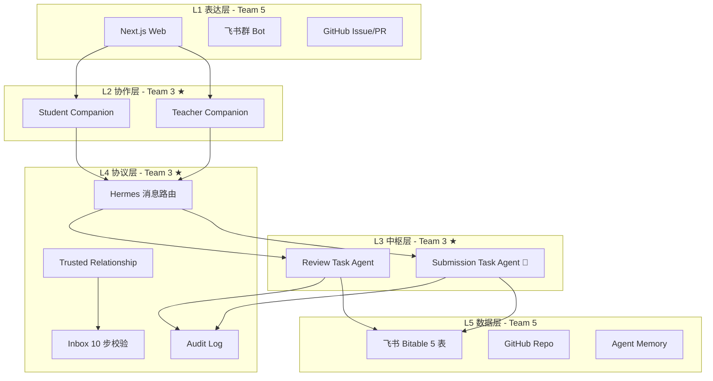

# Team 3 — Agent Team

> 负责开发课程 Agent 与智能体架构。把"冷冰冰的代码"变成"会协作的 AI 同事"。

---

## 目录

- [团队信息](#团队信息)
- [职责范围](#职责范围)
- [架构概览](#架构概览)
- [交付物清单](#交付物清单)
- [架构红线](#架构红线)
- [验收标准](#验收标准)
- [快速开始](#快速开始)
- [相关文档](#相关文档)

---

## 团队信息

| 项目 | 内容 |
|---|---|
| **成员** | 冯静雯、张照航、陈万康 |
| **主战场** | `agents/` + `teams/agent-team/` |
| **上级目标** | 让 Builder workflow 跑通（Situation → Agent → 协作 → 评审 → 知识沉淀）|

---

## 职责范围

### 做什么

- 4 个核心 Agent 的设计、实现、维护
- Agent 之间的消息协议（9 种 Message Type）
- Agent 的权限体系（10 条架构红线）
- Agent 的审计日志（每次状态变化都留痕）
- Agent 的"配置不写死"（从 ResourceConfig 解析路径）

### 不做什么

| 不做 | 谁做 |
|---|---|
| 挑战元数据设计 | Team 2 (Challenge) |
| 课程大纲设计 | Team 1 (Curriculum) |
| Web 页面 | Team 5 (Platform) |
| 知识沉淀 | Team 6 (Knowledge) |
| 演示视频 | Team 7 (Demo) |

---

## 架构概览



---

## 交付物清单

### ✅ 已完成（P0）

| # | 交付物 | 路径 | 格式 | 行数 |
|---|---|---|---:|---:|
| 1 | Agent Ontology 主文件 | `ontology/core/agent-ontology.ttl` | OWL Turtle | 1137 |
| 2 | SHACL Shapes | `ontology/core/agent-ontology-shapes.ttl` | SHACL Turtle | 671 |
| 3 | SWRL 规则 | `ontology/core/agent-ontology-rules.swrll` | SWRL | 1050 |
| 4 | Submission Record Schema | `ontology/schemas/records/submission-record.schema.json` | JSON Schema | 157 |
| 5 | Challenge Record Schema | `ontology/schemas/records/challenge-record.schema.json` | JSON Schema | 94 |
| 6 | Message Envelope | `ontology/schemas/messages/message-envelope.schema.json` | JSON Schema | 77 |
| 7 | Message Payloads (9种) | `ontology/schemas/messages/message-payloads.schema.json` | JSON Schema | 158 |
| 8 | Agent Manifest | `ontology/schemas/agents/agent-manifest.schema.json` | JSON Schema | 157 |
| 9 | Zod 运行时 (28个导出) | `ontology/schemas/typescript-zod/zod-from-schemas.ts` | TypeScript | 450 |
| 10 | 红线 SPARQL 监控 | `ontology/graph/fuseki/red-line-queries.sparql` | SPARQL | 222 |
| 11 | MVP Demo | `mvp-demo/demo.mjs` | JS (可运行) | 470+ |
| 12 | Docker Compose | `ontology/scripts/docker-compose.yml` | YAML | 49 |
| 13 | 加载脚本 | `ontology/scripts/load-*.sh` | Bash | 3 |
| 14 | 验证脚本 | `ontology/scripts/validate.sh` + `python/*.py` | Bash + Python | 6 |
| 15 | CI/CD | `ontology/scripts/ontology-validate.yml` | GitHub Actions | 280 |
| 16 | 本体 README | `ontology/README.md` | Markdown | 299 |
| 17 | Quickstart | `ontology/docs/guides/quickstart.md` | Markdown | 214 |
| 18 | ADR × 3 | `ontology/docs/adr/*.md` | Markdown | 3 |

### 📋 抽取报告（知识层）

| # | 文件 | 内容 |
|---|---|---|
| 1 | `reports/Team3-语义模块抽取.md` | 7 层混合抽取（186 模块）|
| 2 | `reports/Team3-实体概念抽取.md` | T+A-Box（164 抽取物）|
| 3 | `reports/Team3-关系抽取.md` | R-Box（130 关系）|
| 4 | `reports/Team3-规则抽取.md` | 10 红线 OWL/SHACL/SWRL/SPARQL |
| 5 | `reports/Team3-事件抽取.md` | 14 事件 + 因果链 |
| 6 | `reports/Team3-流程抽取.md` | 4 流程 36 步 |
| 7 | `reports/Team3-技能抽取.md` | 10 Skill + I/O |
| 8 | `reports/本体构建方法论.md` | 4 套方法 + 7 步流水线 |

### 📋 架构文档

| # | 文件 | 内容 |
|---|---|---|
| 1 | `docs/Team3-架构总览.md` | 5 层 + 4 Agent + 10 红线 + 9 消息 + 4 流程 |
| 2 | `docs/主仓-vs-Team3-架构对比.md` | 业务层 vs 系统层对比 |
| 3 | `docs/Team3-小白讲解.md` | 入门级讲解（非技术背景）|

---

## 架构红线

### 🔴 Critical（5 条）

| # | 规则 | 违反后果 |
|---|---|---|
| RED-001 | Submission Task Agent 是**唯一**能写 Submission Record 的 Agent | 学生提交流程不通过 |
| RED-002 | Student Companion **不能**直接写最终 Submission Record | 安全告警 |
| RED-006 | 所有 Agent 消息**必须**经过 Inbox 校验 | 拒绝投递 |
| RED-007 | 消息发送前**必须**校验 Trusted Relationship | 拒绝投递 |
| RED-008 | 每次状态变化**必须**写 Audit Trace | 不允许状态变更 |

### 🟠 High（2 条）

| # | 规则 |
|---|---|
| RED-003 | Teacher Companion 不能访问学生私有记忆 |
| RED-004 | Student Companion 不能访问其他学生数据 |

### 🟡 Medium（3 条）

| # | 规则 |
|---|---|
| RED-005 | Student Companion 只能提交到 active 状态的 Challenge |
| RED-009 | Agent 不包含推送通知逻辑 |
| RED-010 | Agent 到人通知必走飞书 Bot |

### 5 维度形式化覆盖

每条红线在 5 个维度上都有对应实现：

| 维度 | 语言 | 文件 |
|---|---|---|
| 设计期 | OWL 2 DL | `agent-ontology.ttl` |
| 校验期 | SHACL | `agent-ontology-shapes.ttl` |
| 推理期 | SWRL | `agent-ontology-rules.swrll` |
| 运行期 | Zod / JSON Schema | `ontology/schemas/` |
| 监控期 | SPARQL | `red-line-queries.sparql` |

---

## 验收标准

### 功能标准

- [x] 任意一次提交都能看出：谁发起、哪个 Agent 处理、写入了哪条飞书记录、指向哪个 GitHub commit、路由给谁评审
- [x] Student Companion Agent 没有直接写 Submission Record 的权限
- [x] Submission Task Agent 有独立 agent_id 和审计日志
- [x] 所有消息都有完整的 Message Envelope（9 字段）
- [x] 每次状态变化都有 Audit Trace
- [x] 关键状态变更（提交成功/失败、评审完成、待复核）有飞书 Bot 通知
- [x] Agent 模块不包含任何推送通知逻辑
- [x] `agent-collaboration-flow.md` 中 `→` 和 `【】` 的边界清晰可读

### 技术标准

- [ ] OWL Reasoner 一致性验证（HermiT / Pellet 跑通）
- [ ] SHACL Shapes 全部实例验证通过
- [ ] SWRL 17 条规则全部可触发
- [ ] JSON Schema 30 个文件全部 valid
- [ ] E2E 测试覆盖率 ≥ 80%

---

## 快速开始

### 1. 跑 MVP Demo

```bash
cd teams/agent-team/mvp-demo
node demo.mjs
# → 跑完 13 步 MVP 闭环，产出 9 个文件到 output/
```

### 2. 启动 Neo4j + Fuseki

```bash
cd teams/agent-team/ontology/scripts
docker-compose up -d
# Neo4j: http://localhost:7474 (neo4j/password)
# Fuseki: http://localhost:3030 (admin/admin)
```

### 3. 加载本体

```bash
./load-neo4j.sh
./load-fuseki.sh
```

### 4. 验证

```bash
./validate.sh
cd ../..
python3 ontology/scripts/python/run_red_line_queries.py \
    --fuseki-url http://localhost:3030/team3
```

### 5. 在 Next.js 项目中使用 Zod

```typescript
import { SubmissionRecordSchema } from '@/schemas/zod-from-schemas';
const result = SubmissionRecordSchema.safeParse(req.body);
```

---

## 相关文档

| 文档 | 用途 |
|---|---|
| `ontology/README.md` | 本体工程入口 |
| `ontology/docs/guides/quickstart.md` | 5 分钟上手 |
| `ontology/docs/adr/0001-use-owl-turtle.md` | 为什么选 OWL Turtle |
| `ontology/docs/adr/0002-use-neo4j-and-fuseki.md` | 为什么双数据库 |
| `ontology/docs/adr/0003-red-line-formalization.md` | 为什么 5 维度形式化 |
| `docs/Team3-架构总览.md` | 架构全貌 + Mermaid 图 |
| `docs/主仓-vs-Team3-架构对比.md` | 业务层 vs 系统层 |
| `docs/Team3-小白讲解.md` | 入门讲解（非技术背景）|

---

## 与主仓已有文件的关系

| 主仓已有 | Team 3 新增 | 关系 |
|---|---|---|
| `agents/manifests/*.schema.json` (4) | `ontology/schemas/agents/agent-manifest.schema.json` | 主仓已有具体 Agent，Team 3 新增通用模板 |
| `agents/messages/message-envelope-schema.md` | `ontology/schemas/messages/*.schema.json` | 主仓 Markdown 版，Team 3 新增 JSON Schema 版 |
| `agents/inbox/README.md` | `ontology/core/agent-ontology-shapes.ttl` | 主仓设计文档，Team 3 新增形式化约束 |
| `agents/audit/audit-log-schema.md` | `ontology/core/agent-ontology.ttl` | 同上 |
| `ontology/agent-ontology.md` | `ontology/core/agent-ontology.ttl` | 主仓 Markdown，Team 3 新增 OWL 工程化 |
| 无 | `ontology/core/agent-ontology-shapes.ttl` | **全新** |
| 无 | `ontology/core/agent-ontology-rules.swrll` | **全新** |
| 无 | `mvp-demo/demo.mjs` | **全新** |
| 无 | `ontology/scripts/` (7 个脚本) | **全新** |

---

> **最后更新**: 2026-07-10
> **版本**: 1.0.0
> **状态**: P0 全部完成，MVP 可用
