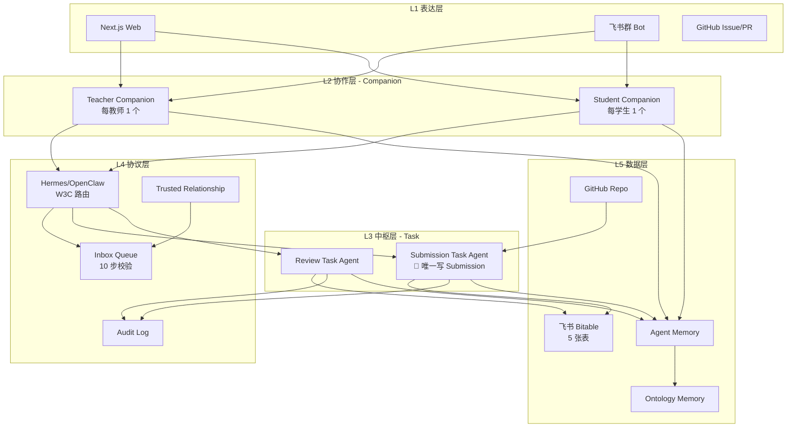
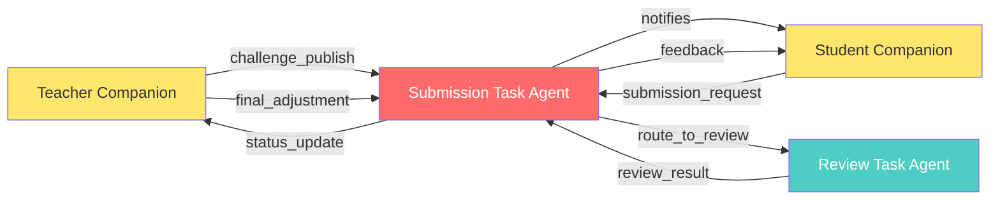
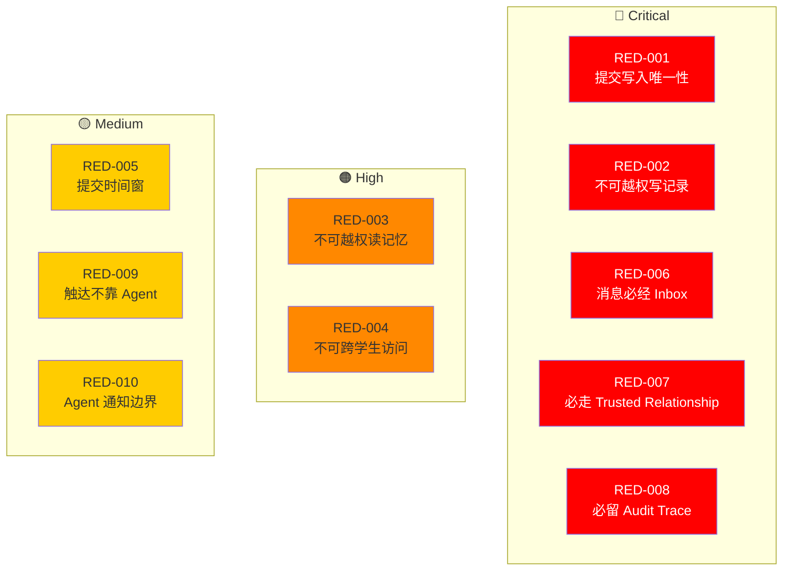
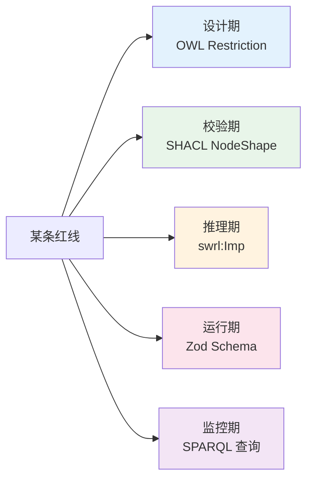
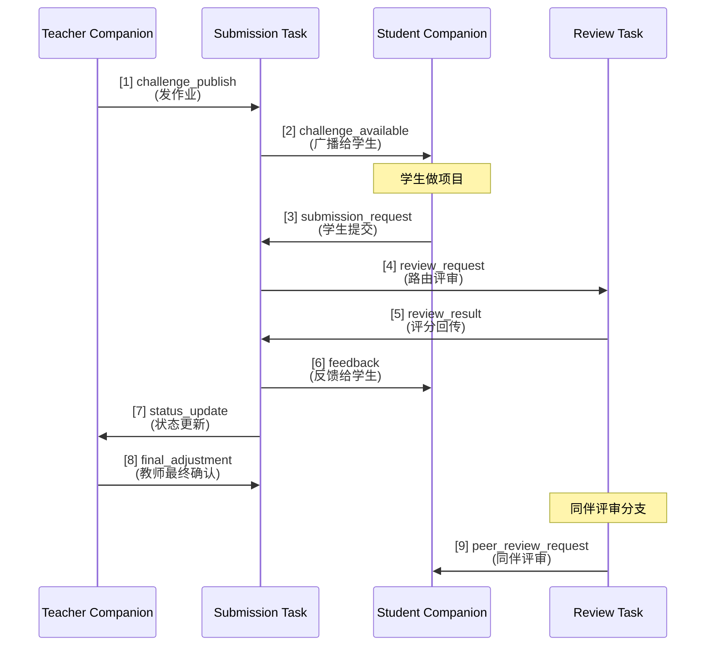
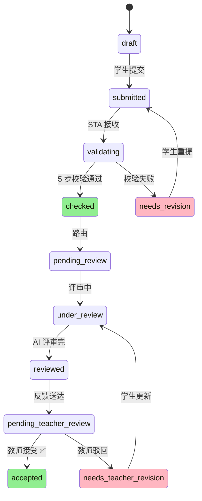
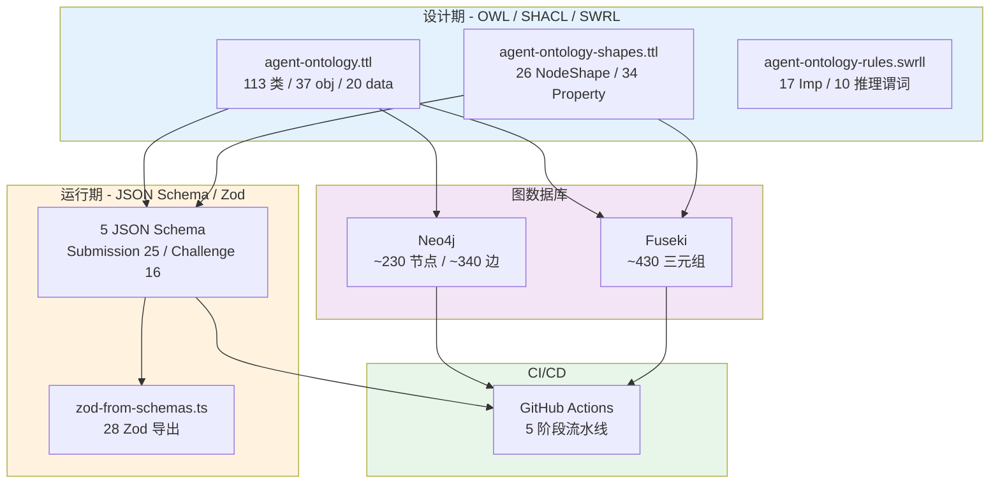
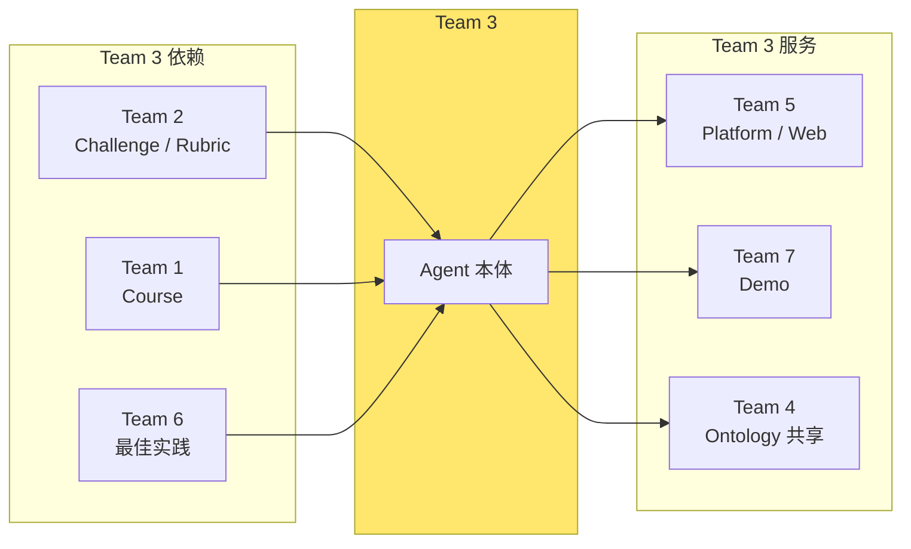

# Team 3 架构总览

> 从 6 份抽取报告 + 已完成本体工程中梳理出的完整架构。

---

## 目录

- [一、整体架构（5 层）](#一整体架构5-层)
- [二、4 个核心 Agent](#二4-个核心-agent)
- [三、10 条架构红线](#三10-条架构红线)
- [四、9 种消息流](#四9-种消息流)
- [五、4 大业务流程（36 步）](#五4-大业务流程36-步)
- [六、本体架构（已工程化）](#六本体架构已工程化)
- [七、依赖与上下游](#七依赖与上下游)
- [八、一句话总结](#八一句话总结)

---

## 一、整体架构（5 层）



**5 层职责**：

| 层 | 角色 | 谁负责 |
|---|---|---|
| L1 表达层 | Web / Bot / GitHub UI | Team 5 (Platform) |
| L2 协作层 | Companion Agent（个人助理）| Team 3 |
| L3 中枢层 | Task Agent（系统级）| Team 3 |
| L4 协议层 | 消息路由 / 审计 / 信任 | Team 3 |
| L5 数据层 | 飞书 + GitHub + Memory | Team 5 + Team 3 |

---

## 二、4 个核心 Agent



**3 套命名约定**（融合 3 份资料）：

| 来源 | 命名 | 数量 |
|---|---|---|
| PRD v0.3 | Companion Agent + Task Agent | 4 法定 |
| MVP 系统设计 | Raymond × 3 角色 | Student/Professor/Admin |
| 主仓 7.6 | Companion / Task / Review / Submission | 4 角色 |

**统一方案**：
- MVP 阶段：**PRD 法定 4 个核心 Agent**
- Raymond 作为品牌别名
- 3 角色模板作为配置

| Agent | agent_id 模式 | 唯一性 | 类比 |
|---|---|---|---|
| **Student Companion** | `student-companion-{student_id}` | 每学生 1 | 你的"学习秘书" |
| **Teacher Companion** | `teacher-companion-{teacher_id}` | 每教师 1 | 老师的"教学助理" |
| **Submission Task Agent** | `submission-task-agent` | **单例或池** | 学校的"教务处"（🔴 唯一盖章）|
| **Review Task Agent** | `review-task-agent` | 单例或池 | 阅卷老师 |

---

## 三、10 条架构红线



**5 维度形式化**（每条红线都有 5 份实现）：



| 维度 | 工具 | 时期 | 拦在哪 |
|---|---|---|---|
| **OWL** | 描述逻辑 | 设计 | 团队讨论 / 文档 |
| **SHACL** | Shapes | 校验 | 数据写入 DB 前 |
| **SWRL** | Rules | 推理 | OWL Reasoner 启动 |
| **Zod** | TS Schema | 运行 | Next.js API 入口 |
| **SPARQL** | Query | 监控 | 定时跑 / CI |

**总强制点**：10 条 × 5 维度 = **50 处**自动强制

---

## 四、9 种消息流



**配套协议层**：

```text
MessageEnvelope (9 字段)
├── message_id       (msg-{nanoid})
├── request_id       (req-{nanoid})    ← 幂等去重
├── from_agent
├── to_agent
├── message_type     (9 种枚举)
├── timestamp
├── payload          (按 message_type 一对一)
├── routing_metadata (priority/ttl/retry/ack)
└── audit_trace_pointer  (audit-{nanoid})  🔴 RED-008
```

---

## 五、4 大业务流程（36 步）

### P1: MVP 最小闭环（13 步）

```mermaid
flowchart LR
    P1_01[01 ExcelImport] --> P1_02[02 ImportFeishu]
    P1_02 --> P1_03[03 CreateCourseSpace]
    P1_03 --> P1_04[04 InitPersonalOKF]
    P1_04 --> P1_05[05 StartStudent]
    P1_05 --> P1_06[06 CreateChallenge]
    P1_06 --> P1_07[07 ReceiveChallenge]
    P1_07 --> P1_08[08 DoProject]
    P1_08 --> P1_09[09 SaveArtifact]
    P1_09 --> P1_10[10 GenerateAAR]
    P1_10 --> P1_11[11 SelfEvaluate]
    P1_11 --> P1_12[12 SubmitToFeishu]
    P1_12 --> P1_13[13 UpdatePortfolio]
```



### P2: Agent 协作（4 子流程 / 16 步）

| 子流程 | 步数 | 触发 |
|---|---:|---|
| P2A Publish | 4 | Teacher UI 操作 |
| P2B Submit | 4 | Student UI 操作 |
| P2C Review | 4 | STA 路由 |
| P2D FinalAdjust | 4 | Teacher 飞书确认 |

### P3: Inbox 处理（10 步校验链）

```mermaid
flowchart LR
    P3_01[1 接收消息] --> P3_02[2 身份验证]
    P3_02 --> P3_03[3 签名验证]
    P3_03 --> P3_04[4 TrustCheck]
    P3_04 --> P3_05[5 权限验证]
    P3_05 --> P3_06[6 重复检测]
    P3_06 --> P3_07[7 过期检测]
    P3_07 --> P3_08[8 队列路由]
    P3_08 --> P3_09[9 处理执行]
    P3_09 --> P3_10[10 Audit+ACK]

    style P3_02 fill:#ffe66d
    style P3_04 fill:#ffe66d
    style P3_05 fill:#ffe66d
    style P3_10 fill:#ffe66d
```



> 黄底 = 关联架构红线（RED-002/004/006/007/008）

### P4: Submission 状态机（11 态）



---

## 六、本体架构（已工程化）



**完成度**：~96%（P0 全部完成，MVP 可用）

---

## 七、依赖与上下游



**关键依赖**：
- **输入**：Team 2 提供的 Rubric、Team 1 提供的 Course、Team 6 的最佳实践
- **输出**：Team 5 拿到协议做 API、Team 7 拿演示做宣传、Team 4 共享本体定义

---

## 八、一句话总结

> **Team 3 的架构 = 4 个 AI Agent（2 Companion + 2 Task）+ 5 件事（规矩/邮件/审计/权限/校验）+ 10 条红线 × 5 维度形式化 + 9 种消息流 + 4 大流程 36 步 + 完整的本体工程。**

### 核心数字

| 维度 | 数量 |
|---|---:|
| Agent 类 | 15 |
| Task Agent 子类 | 17 |
| 协议类 | 17 |
| 业务类 | 12 |
| Skill 类 | 16 |
| Event 类 | 14 |
| 流程步数 | 36 |
| 消息类型 | 9 |
| 架构红线 | 10 |
| 红线强制点 | 50 (10×5) |
| 抽取物总数 | ~430 |
| 本体类 | 113 |
| 对象属性 | 37 |
| 数据属性 | 20 |
| JSON Schema | 5 |
| Zod 导出 | 28 |
| OWL 行数 | 1137 |
| SHACL 行数 | 671 |
| SWRL 行数 | 1050 |

### 核心理念

> **用本体（OWL / SHACL / SWRL）把"规矩"从 README 升级为"机器可推理、可校验、可监控的硬约束"——让任何破坏行为在任何一层都被自动拦下。**

---

## 附录：已交付文件清单

| 阶段 | 文件 | 数量 |
|---|---|---:|
| 设计期（OWL） | `ontology/core/agent-ontology.ttl` | 1 |
| 设计期（SHACL） | `ontology/core/agent-ontology-shapes.ttl` | 1 |
| 设计期（SWRL） | `ontology/core/agent-ontology-rules.swrll` | 1 |
| 运行期（JSON） | `ontology/schemas/**/*.schema.json` | 5 |
| 运行期（Zod） | `ontology/schemas/typescript-zod/zod-from-schemas.ts` | 1 |
| 图数据库（SPARQL） | `ontology/graph/fuseki/red-line-queries.sparql` | 1 |
| 工具（脚本） | `ontology/scripts/**` | 7 |
| 文档 | `ontology/README.md` + ADR × 3 + quickstart | 5 |
| **总计** | | **22 文件 / ~6300 行 / 221 KB** |

---

> **最后更新**: 2026-07-08
> **版本**: 1.0.0
> **状态**: ✅ P0 全部完成，MVP 可用
