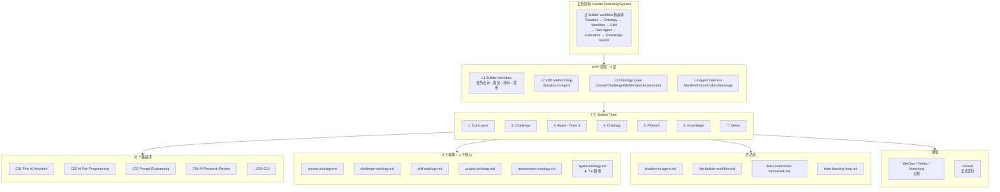
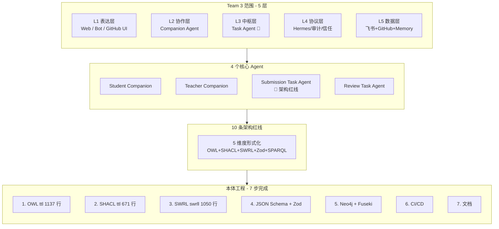
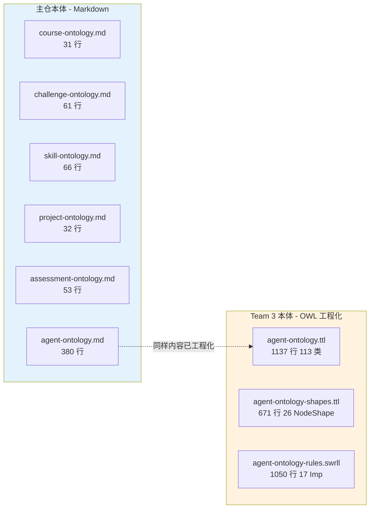
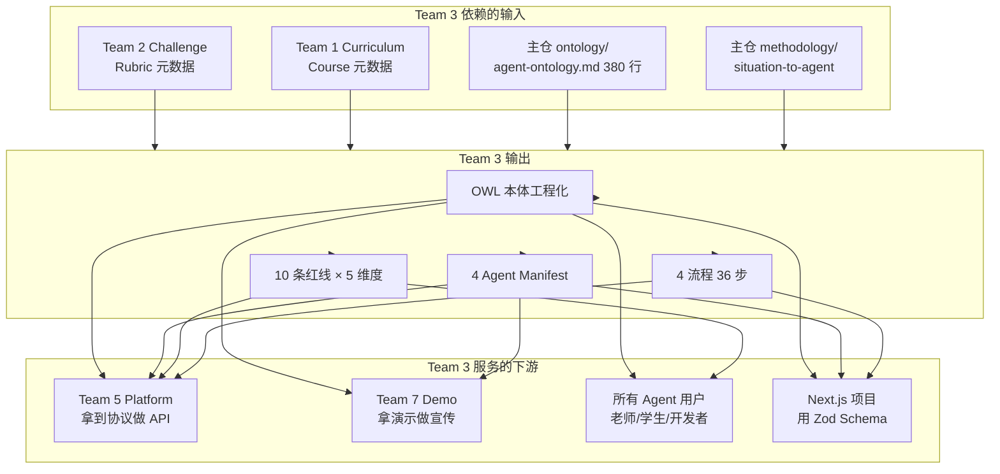
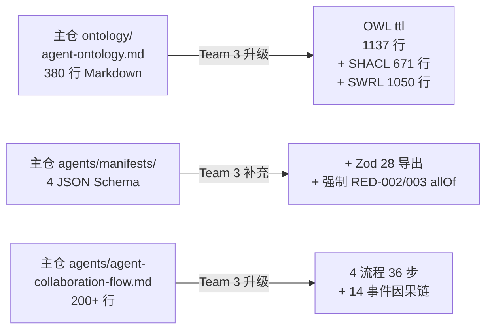
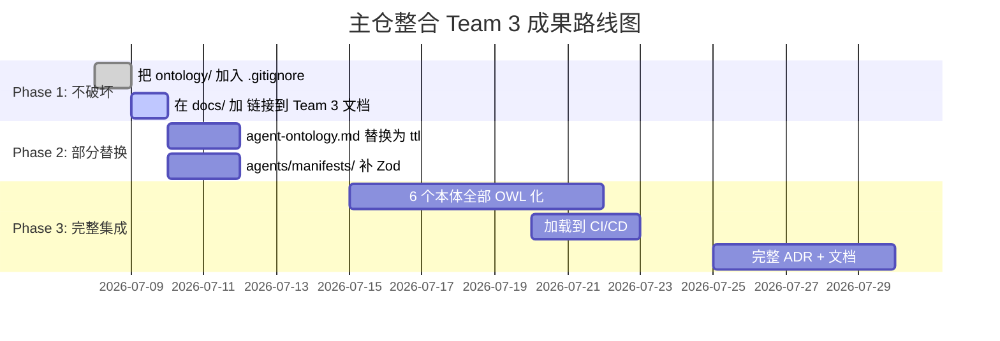

# 主仓 vs Team 3 架构对比

> 把主仓库（elite20-builder-program-nseap）的整体架构与 Team 3 的架构放在一起对比，看清**业务层 vs 系统层**的边界和连接。

---

## 目录

- [一、主仓库整体架构](#一主仓库整体架构)
- [二、Team 3 架构（系统层）](#二team-3-架构系统层)
- [三、并排对比](#三并排对比)
- [四、依赖与连接点](#四依赖与连接点)
- [五、Team 3 造的东西 vs 主仓已有的](#五team-3-造的东西-vs-主仓已有的)
- [六、Team 3 还没造的（来自主仓）](#六team-3-还没造的来自主仓)
- [七、整合方案](#七整合方案)

---

## 一、主仓库整体架构



### 主仓核心特点

| 维度 | 内容 |
|---|---|
| **定位** | Builder Operating System（建设者操作系统）|
| **核心循环** | `Situation → Ontology → Workflow → Skill → Task Agent → Evaluation → Knowledge Growth` |
| **范围** | 课程 + 挑战 + Skill + Agent + 知识沉淀 全栈 |
| **目标用户** | 7 个 Builder Team（不只是 Team 3）|
| **首要交付** | 让 Builder workflow 跑通 |
| **Agent 部分** | 7.6 才新增（agent-ontology.md 380 行）|
| **本体** | 6 个 + agent = 7 个（Markdown 形式）|
| **挑战库** | 10 个（Challenge Library C01-C10）|

---

## 二、Team 3 架构（系统层）



### Team 3 核心特点

| 维度 | 内容 |
|---|---|
| **定位** | Agent Team（智能体系统层）|
| **核心交付** | 4 个 Agent + 5 件事 + 10 条红线 + 本体工程 |
| **范围** | 仅"Agent 怎么协作"（不关心教学内容）|
| **目标用户** | Team 5 (Platform) + 老师/学生 + 系统管理员 |
| **首要交付** | 协议可机读、约束可校验、违规可拦截 |
| **本体** | 1 个（agent-ontology）已工程化为 5 维度形式化 |
| **挑战** | 不涉及挑战设计（那是 Team 2 的事）|

---

## 三、并排对比

### 3.1 维度对比表

| 维度 | 主仓 | Team 3 | 关系 |
|---|---|---|---|
| **定位** | Builder OS（操作系统）| Agent System（智能体子系统）| Team 3 是主仓的一个子系统 |
| **核心循环** | Situation → ... → Knowledge | Agent 协作闭环（4 Agent 9 消息 4 流程）| Team 3 实现主仓循环的"系统部分" |
| **关心** | "教什么考什么" | "AI 怎么协作" | 互补：业务 vs 系统 |
| **本体** | 6 个业务本体（Markdown）| 1 个 Agent 本体（OWL 工程化）| Team 3 用了主仓本体作输入 |
| **Agent 数量** | 4 法定（7.6）| 4 法定 + 17 系统设计 | Team 3 是 Agent 的设计者 |
| **红线** | README 描述 | 5 维度形式化（OWL+SHACL+SWRL+Zod+SPARQL）| Team 3 把"软约束"升级为"硬约束" |
| **目标交付** | 模板 + 工具 | 可机读本体 + 可执行协议 | Team 3 的产出是主仓的"运行时" |
| **形式化程度** | Markdown 文档 | W3C 标准（OWL 2 DL / SHACL / SWRL）| Team 3 工程化主仓的本体 |
| **测试覆盖** | 模板自检 | 10 条红线 SPARQL 监控 | Team 3 提供持续监控 |
| **CI/CD** | 无 | 5 阶段 GitHub Actions | Team 3 引入自动化 |

### 3.2 文件结构对比

```text
主仓 (elite20-builder-program-nseap)         Team 3 工程产出 (ontology/)
├── docs/                                    ├── core/
│   ├── vision.md                            │   ├── agent-ontology.ttl
│   ├── workflow.md                          │   ├── agent-ontology-shapes.ttl
│   ├── mvp-roadmap.md                       │   └── agent-ontology-rules.swrll
│   └── phase2-builder-task-plan.md         │
│                                           ├── schemas/
├── methodology/                             │   ├── records/ (2 JSON Schema)
│   ├── situation-to-agent.md                │   ├── messages/ (2 JSON Schema)
│   ├── fde-builder-workflow.md             │   ├── agents/ (1 JSON Schema)
│   ├── skill-construction-framework.md     │   └── typescript-zod/ (1 TS)
│   └── kstar-learning-loop.md              │
│                                           ├── graph/
├── ontology/                                │   ├── neo4j/
│   ├── course-ontology.md (31 行)          │   └── fuseki/ (SPARQL)
│   ├── challenge-ontology.md (61 行)        │
│   ├── skill-ontology.md (66 行)            ├── scripts/ (3 bash + 3 python)
│   ├── project-ontology.md (32 行)         ├── docker-compose.yml
│   ├── assessment-ontology.md (53 行)       ├── ontology-validate.yml
│   └── **agent-ontology.md (380 行)** ⭐   └── docs/ (README + 3 ADR + quickstart)
│
├── agents/                                  
│   ├── agent-collaboration-flow.md          
│   ├── manifests/ (4 JSON Schema)          
│   ├── messages/                           
│   ├── audit/                              
│   ├── inbox/                              
│   └── (旧方向 3 Agent Markdown)          
│
├── challenges/ (C01-C10)                   
│                                           总计: 22 文件 / 6300 行 / 221 KB
├── teams/
│   ├── agent-team/  ← Team 3 自治目录
│   ├── ontology-team/
│   └── (其他 5 个 Team)
│
├── knowledge-base/ (FAQ / best-practices)
│
└── examples/
    └── challenge-to-cognitive-cell-case/
```

### 3.3 本体形式对比



**关键观察**：
- 主仓的 6 个业务本体是**Markdown 形式**（人读）
- Team 3 把 agent-ontology.md 升级为 **OWL 工程化**（机器读）
- 其他 5 个业务本体（course/challenge/skill/project/assessment）还是 Markdown —— **Team 3 还没工程化**

---

## 四、依赖与连接点



### 关键连接点

| 连接点 | 谁 → 谁 | 内容 |
|---|---|---|
| **主仓 → Team 3** | `ontology/agent-ontology.md` | 7.6 新增的 380 行 Markdown（已被 Team 3 工程化）|
| **Team 3 → Team 5** | `agents/manifests/*.schema.json` | 4 个 Agent Manifest（Team 5 拿去实现 API）|
| **Team 3 → Next.js** | `schemas/typescript-zod/zod-from-schemas.ts` | 28 个 Zod 导出（直接 import）|
| **Team 2 → Team 3** | Challenge / Rubric 定义 | Team 3 在 Challenge 元数据上建 Agent 行为 |
| **Team 3 → Team 7** | 演示流程（4 流程 36 步）| Team 7 拍 3 分钟 demo 视频 |

---

## 五、Team 3 造的东西 vs 主仓已有的

### 5.1 主仓已有但 Team 3 工程化了



| 主仓已有 | Team 3 工程化 | 增量 |
|---|---|---|
| `ontology/agent-ontology.md` (380 行) | `core/agent-ontology.ttl` (1137 行) | +757 行 OWL / +20 倍 |
| `agents/manifests/*.schema.json` (4) | + Zod + SHACL | +28 Zod / +26 SHACL NodeShape |
| `agents/agent-collaboration-flow.md` | + 14 事件 + 4 流程 36 步 | 多了流程 + 事件抽取 |
| `agents/audit/audit-log-schema.md` | + OWL Restriction + SPARQL 监控 | 形式化 5 维度 |
| `agents/inbox/README.md` | + SHACL + SWRL + Zod | 多了校验脚本 |
| 无 | `core/agent-ontology-rules.swrll` (17 Imp) | **全新** |
| 无 | `schemas/typescript-zod/zod-from-schemas.ts` | **全新** |
| 无 | `graph/fuseki/red-line-queries.sparql` (10 红线) | **全新** |
| 无 | `scripts/` (7 脚本) + `ontology-validate.yml` | **全新** |

### 5.2 主仓没有但 Team 3 造了

| Team 3 新增 | 数量 | 价值 |
|---|---:|---|
| OWL Turtle 主本体 | 1137 行 | 把 Markdown 升级为 W3C 标准 |
| SHACL Shapes | 26 NodeShape | 数据写入时自动校验 |
| SWRL 规则 | 17 Imp | OWL Reasoner 自动推理 |
| JSON Schema 集合 | 5 文件 | Next.js 运行时 |
| Zod 导出 | 28 | TypeScript 类型安全 |
| SPARQL 红线查询 | 11 | 持续监控 |
| Neo4j Cypher | ~230 节点 | 图遍历 |
| 加载脚本 | 7 个 | 一键启动 |
| CI/CD | 5 阶段 | 自动化校验 |
| ADR | 3 个 | 架构决策记录 |
| Quickstart | 1 个 | 5 分钟上手 |
| **总计新增** | **22 文件 / 6300 行 / 221 KB** | |

---

## 六、Team 3 还没造的（来自主仓）

| 主仓已有 | Team 3 状态 | P0 缺口 | 备注 |
|---|---|:---:|---|
| `course-ontology.md` (31 行) | ❌ 未工程化 | 🟡 | 业务层，可缓做 |
| `challenge-ontology.md` (61 行) | ❌ 未工程化 | 🟡 | 业务层，可缓做 |
| `skill-ontology.md` (66 行) | ⚠️ 部分（Zod）| 🟡 | 需要独立 JSON Schema |
| `project-ontology.md` (32 行) | ❌ 未工程化 | 🟢 | 不急 |
| `assessment-ontology.md` (53 行) | ❌ 未工程化 | 🟢 | 不急 |
| 旧方向 3 Agent (Coding Coach / Evaluation / Project Manager) | ❌ stub 状态 | 🟡 | 需升级为 JSON Schema |
| Mentor Agent | ❌ 未实现 | 🟢 | v1.1 |
| KnowledgeLibrarian Agent | ❌ 未实现 | 🟢 | v1.1 |
| Outbox README | ❌ README 答应但未交付 | 🔴 | P0 缺口 |
| 2 个 payload JSON Schema | ❌ README 答应但未交付 | 🔴 | P0 缺口 |
| Neo4j 加载 Cypher 脚本 | ❌ 跑了 6 份抽取报告但没工程化 | 🔴 | P0 缺口 |
| E2E 测试套件 | ❌ 没有 | 🟡 | CI 已搭好但缺测试 |
| 14 个事件 SHACL/SWRL | ⚠️ 仅类抽取 | 🟡 | 已抽但未形式化 |
| 状态机 4 个完整文档 | ❌ 9 态但文档不全 | 🟡 | 抽到了但未出独立状态机文档 |

---

## 七、整合方案

### 7.1 主仓要不要把 Team 3 的工程化结果并入？

**答案**：**要，但分阶段**。



### 7.2 建议的 PR 结构

```text
PR 1: docs/ 链接（不破坏主仓）
  + docs/team3-architecture.md 链接到 ontology/README.md
  + docs/contributing-ontology.md 解释如何用 Team 3 工具

PR 2: 替换 agent-ontology.md
  - ontology/agent-ontology.md  ← 旧 Markdown
  + core/agent-ontology.ttl      ← 新 OWL（同等内容）
  + core/agent-ontology-shapes.ttl
  + core/agent-ontology-rules.swrll

PR 3: 补充 Agent Manifests
  + agents/manifests/coding-coach-agent.schema.json
  + agents/manifests/evaluation-agent.schema.json
  + agents/manifests/project-manager-agent.schema.json

PR 4: 补充 Outbox
  + agents/outbox/README.md
  + agents/outbox/SPEC.md

PR 5: 补充 Payload JSON Schema
  + agents/messages/challenge-submission-request.schema.json
  + agents/messages/challenge-review-request.schema.json
```

### 7.3 命名建议

主仓的 `agents/` 目录与 Team 3 的 `ontology/` 目录建议这样协作：

```text
主仓 (elite20-builder-program-nseap)/
├── agents/                           ← 主仓保留
│   ├── agent-collaboration-flow.md  ← 保留（旧版本）
│   ├── manifests/                    ← 保留（4 Agent）
│   ├── messages/                     ← 保留
│   ├── audit/                        ← 保留
│   └── inbox/                        ← 保留
│
└── ontology/                         ← 主仓保留（但部分工程化）
    ├── agent-ontology.md  ← 标记为 DEPRECATED
    └── (新结构...)
        ├── core/                    ← 引入 Team 3 形式化
        ├── schemas/                  ← 引入 Team 3 JSON Schema
        └── graph/                   ← 引入 Team 3 SPARQL/Cypher
```

---

## 八、最终对比

| | 主仓 | Team 3 |
|---|---|---|
| **本质** | 操作系统 | 系统层子系统 |
| **Agent 数量** | 4 + 14 系统设计 | 4 法定 + 17 系统设计 + 7 个旧方向 |
| **本体** | 6 Markdown | 1 OWL（工程化 5 维度）|
| **流程** | 文档 200+ 行 | 4 流程 36 步 + 14 事件 |
| **红线** | 10 条 README 描述 | 10 条 × 5 维度形式化（50 强制点）|
| **测试** | 模板自检 | 10 条 SPARQL 监控 + 5 阶段 CI |
| **文档** | 3-4 个 Markdown | README + 3 ADR + quickstart + 多份抽取报告 |
| **完成度** | ~70% (整体 MVP) | ~96% (本体工程) |
| **下一步** | 等其他 Team 补全 | 等主仓合并 P0 缺口 |

### 一句话对比

> **主仓是"操作系统蓝图"（人写、人读），Team 3 是"系统层实现"（机器可读、可推理、可校验）。**
>
> **主仓 = 教学大纲 + 校规。Team 3 = 校规的工程化 + 校规的执行器。**

---

> **最后更新**: 2026-07-08
> **版本**: 1.0.0
> **状态**: ✅ 对比文档完成
